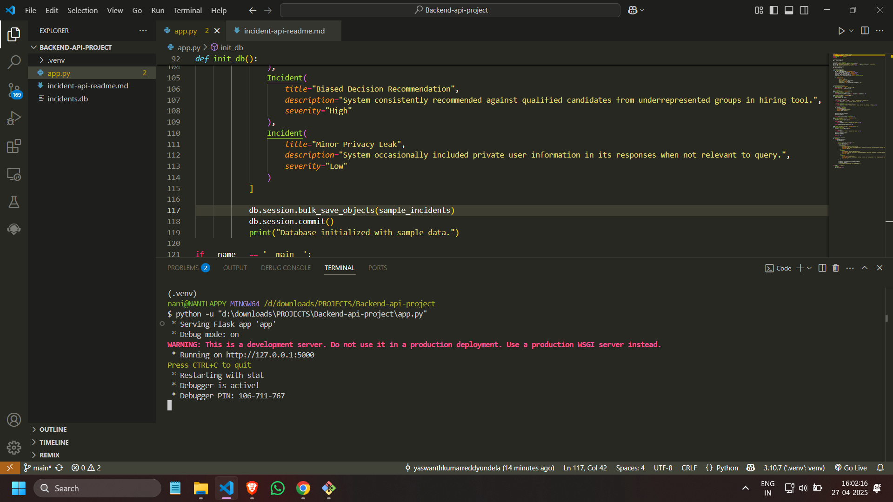
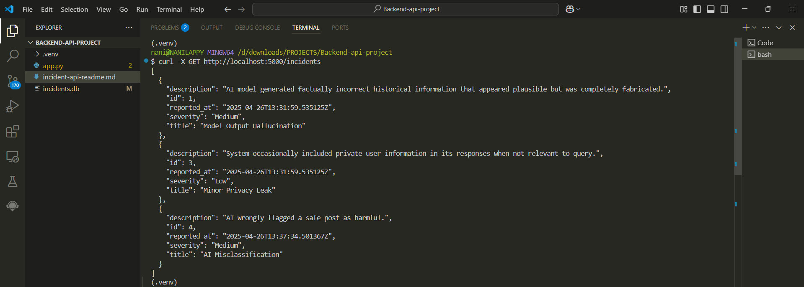
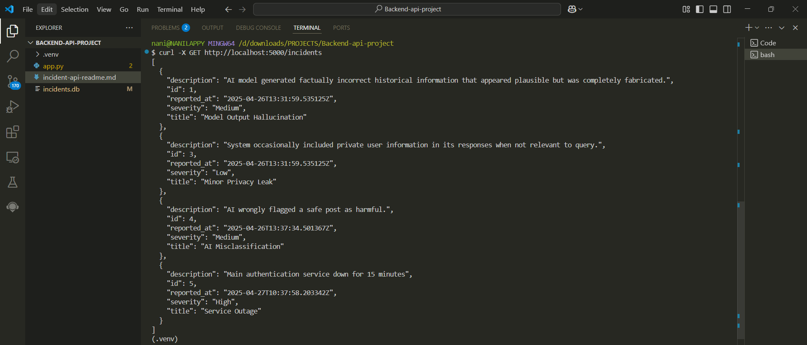

# HumanChain AI Safety Incident Log API
A simple RESTful API built with Flask for logging and managing AI safety incidents. This API allows you to create, retrieve, and delete incident reports related to AI safety issues such as model bias, data breaches, and unethical AI decisions.


## Technology Stack

- **Language**: Python
- **Framework**: Flask
- **Database**: SQLite
- **ORM**: SQLAlchemy

## Setup Instructions

### Prerequisites

- Python 3.6 or higher
- pip (Python package manager)

### Installation

1. Clone the repository:
   ```
   git clone https://github.com/Yaswanthkumarreddyundela/Backend-api-project.git
   cd Backend-api-project
   ```

2. Create and activate a virtual environment (recommended):
   ```
   python -m venv venv
   
   # On Windows
   venv\Scripts\activate
   
   # On macOS/Linux
   source venv/bin/activate
   ```

3. Install dependencies:
   ```
   pip install flask flask-sqlalchemy
   ```

### Database Setup

The application uses SQLite, which is file-based and doesn't require additional setup. The database will be automatically created in the project directory when you first run the application.

- The database file will be created as `incidents.db` in the root directory
- The database schema and sample data are automatically created when you run the application

### Configuration

By default, the application is configured to use a SQLite database. If you need to modify the database connection:

1. Edit the following line in `app.py`:
   ```python
   app.config['SQLALCHEMY_DATABASE_URI'] = 'sqlite:///' + os.path.join(BASE_DIR, 'incidents.db')
   ```

2. For more complex configurations, consider using environment variables:
   ```python
   # Example of using environment variables
   app.config['SQLALCHEMY_DATABASE_URI'] = os.environ.get('DATABASE_URL', 'sqlite:///' + os.path.join(BASE_DIR, 'incidents.db'))
   ```

## Running the Application

Start the application with:

```
python app.py
```

The API will be available at `http://localhost:5000`



## API Endpoints

### Get All Incidents

Retrieves a list of all incidents.

```
GET /incidents
```

Example using curl:
```
curl -X GET http://localhost:5000/incidents
```

### Get a Specific Incident

Retrieves details about a specific incident by ID.

```
GET /incidents/<id>
```

Example using curl:
```
curl -X GET http://localhost:5000/incidents/1
```


### Create a New Incident

Creates a new incident record.

```
POST /incidents
```

Request body (JSON):
```json
{
  "title": "Service Outage",
  "description": "Main authentication service down for 15 minutes",
  "severity": "High"
}
```

Example using curl:
```
curl -X POST http://localhost:5000/incidents \
  -H "Content-Type: application/json" \
  -d '{"title": "Service Outage", "description": "Main authentication service down for 15 minutes", "severity": "High"}'
```



Note: Severity must be one of: "Low", "Medium", or "High"

### Delete an Incident

Removes an incident from the database.

```
DELETE /incidents/<id>
```

Example using curl:
```
curl -X DELETE http://localhost:5000/incidents/1
```

## Design Decisions

1. **SQLite Database**: Chosen for simplicity and ease of setup. No additional database server is required, making local development straightforward.

2. **Flask & SQLAlchemy**: Lightweight framework with powerful ORM capabilities, allowing for rapid development and clean code structure.

3. **Input Validation**: The API validates the severity level of incidents to ensure data integrity.

4. **Sample Data**: The application automatically populates the database with sample incidents on first run to demonstrate functionality.

5. **ISO Format for Timestamps**: All timestamps are returned in ISO format with UTC timezone for consistency.
